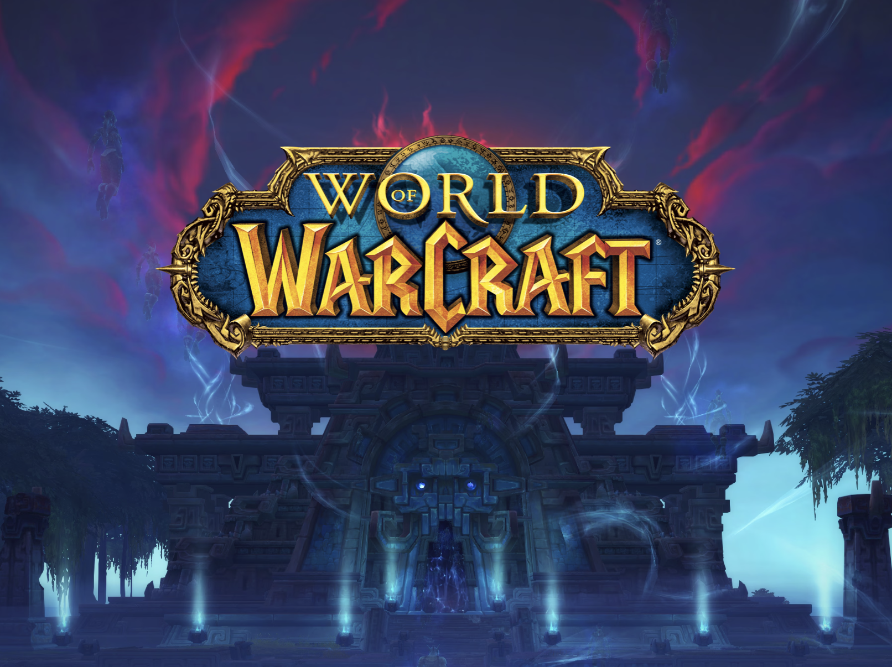

# WowDungeons

Una aplicación Flutter para explorar información sobre las mazmorras clásicas de World of Warcraft.

## Descripción

WowDungeons es una aplicación móvil desarrollada con Flutter que permite a los jugadores de World of Warcraft acceder rápidamente a información detallada sobre las mazmorras clásicas del juego. La aplicación está diseñada con una interfaz temática medieval que se integra perfectamente con la estética del juego, ofreciendo una experiencia visual inmersiva mientras proporciona información útil sobre las mazmorras.

## Características Implementadas

- **Catálogo de Mazmorras**: Listado visual de mazmorras clásicas con imágenes representativas.
- **Detalles de Mazmorras**: Información detallada sobre cada mazmorra, incluyendo descripción, expansión, nivel y ubicación.
- **Información de Jefes**: Listado de jefes para cada mazmorra con sus nombres y mecánicas principales.
- **Diseño Temático**: Interfaz con estilo medieval/WoW que mejora la experiencia de usuario.
- **Manejo de Errores**: Sistema robusto para manejar errores de carga o datos no encontrados.
- **Navegación Intuitiva**: Sistema de navegación simple entre la lista de mazmorras y sus detalles.

## Estructura del Proyecto

- **models/**: Contiene las clases de datos para mazmorras y jefes.
- **viewmodels/**: Implementa la lógica de negocio y gestión de datos.
- **views/**: Contiene las interfaces de usuario para mostrar la información.
- **utils/**: Funciones auxiliares para la interfaz de usuario.
- **img/**: Recursos visuales utilizados en la aplicación.

## Tecnologías

- **Flutter**: Framework para desarrollo multiplataforma.
- **Dart**: Lenguaje de programación.
- **Provider**: Para la gestión de estado.
- **Material Design**: Para la interfaz de usuario con personalización temática.

## Requisitos

- Flutter 3.0.0 o superior
- Dart 2.17.0 o superior

## Estado del Proyecto

Este proyecto tiene implementada la funcionalidad básica para mostrar información sobre mazmorras clásicas de World of Warcraft. Los datos están almacenados localmente en la aplicación.

## Características Futuras

- **Mazmorras de Expansiones Posteriores**: Añadir información de mazmorras de otras expansiones.
- **Guías de Estrategia**: Consejos y estrategias para completar mazmorras con éxito.
- **Recompensas**: Listado de recompensas y botín disponible en cada mazmorra.
- **Búsqueda y Filtros**: Opciones avanzadas para encontrar mazmorras específicas.
- **Modo Offline**: Capacidad para acceder a toda la información sin conexión a internet.

## Contribuciones

Las contribuciones son bienvenidas. Si deseas contribuir:

1. Haz fork del repositorio
2. Crea una nueva rama para tu función
3. Envía un pull request

